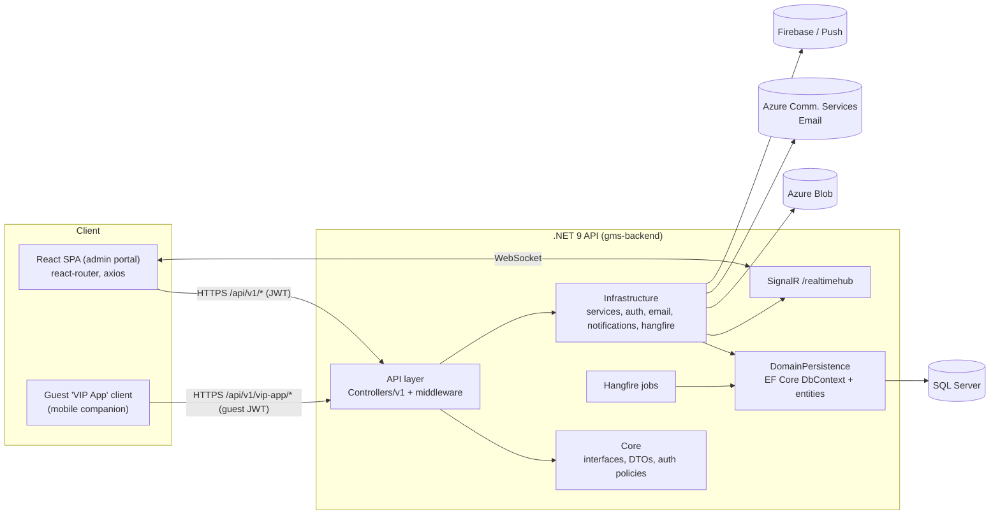

# GMS — Guest Management System · Project Handbook (CLAUDE.md)

> **Living handbook for AI/dev sessions.** Read this file first. It is the entry point; deep detail lives in [`docs/`](docs/). Update this file (and the relevant `docs/*.md`) whenever architecture or business logic changes.

This workspace at `\GMS` contains **two independent git repositories**:

| Folder | Stack | Git remote |
|---|---|---|
| `gms-frontend/` | React 18 + Vite SPA | `github.com/Muhammad-Zohaib-Bawani/gms.git` (branch `main`) |
| `gms-backend/`  | .NET 9 clean-architecture Web API | `github.com/MaazKhan01/gms-backend.git` (branch `development`) |

`\GMS` itself is **not** a git repo — it's the workspace root and the Claude Code working directory (so this `CLAUDE.md` is auto-loaded here).

---

## 📚 Navigation

| Doc | Contents |
|---|---|
| [docs/backend.md](docs/backend.md) | .NET solution — API / Core / Infrastructure / DomainPersistence, DI, middleware, project dependency diagram |
| [docs/frontend.md](docs/frontend.md) | React app — routing, layout, contexts, services, components, hooks, pages, styling, i18n |
| [docs/apis.md](docs/apis.md) | Full REST endpoint inventory (controller → route → permission → DTO → frontend consumer) |
| [docs/database.md](docs/database.md) | DbContext, entities, relationships, migrations, seed data, ER diagram |
| [docs/business-flows.md](docs/business-flows.md) | Auth, guest lifecycle, invitations, accreditation, travel, seating, notifications, support chat, VIP app — with sequence diagrams |
| [docs/current-status.md](docs/current-status.md) | Completed / partial / pending work, known bugs, tech debt, future improvements |

---

# Project Overview

- **Project name:** GMS — Guest Management System (API OpenAPI title: **"GMS API"**).
- **Business purpose:** Manage guests, invitations, travel & logistics, accreditation, seating, meetings and notifications for **high-profile Gulf / Qatar events** (seed data references Doha Forum, Qatar Economic Forum, Doha hotels/airports, "Hayya" travel sync). Branded to the **Qatar Olympic Committee** look (maroon `#8d0134` + white, `Loew Next Arabic` font). Fully **bilingual English/Arabic with RTL**.
- **Overall architecture:** Decoupled SPA + REST API.
  - **Frontend:** React 18 SPA (Vite), react-router v6, axios, talks to the API over `/api` (dev proxy) or a full backend URL (prod).
  - **Backend:** .NET 9 Web API in **clean/onion architecture** (API → Core ← Infrastructure ← DomainPersistence), EF Core + **SQL Server**, JWT auth, **permission-based** authorization, **SignalR** realtime, **Hangfire** background jobs, push notifications (Firebase + manual), Azure Blob storage, Azure Communication Services email.
  - There is also a **separate guest-facing "VIP App" API surface** (`/api/v1/vip-app/*`) with its own OTP login and guest refresh tokens — a mobile companion for guests, distinct from the admin portal.
- **Current completion status (high level):** Core admin portal modules are functional (auth, events, guests, invitations + email builder, travel, seating/venue, meetings, accreditation, users/roles/permissions, account requests, user invites, notifications, support chat, admin **Venues** list). Some frontend modules reference backend endpoints that aren't yet present (**Organizations**, **Vehicles** CRUD) — see [docs/current-status.md](docs/current-status.md). **Financials / Reports / Protocol** are commented out of navigation. Details & percentages in [docs/current-status.md](docs/current-status.md).
- **Tech stack:** see table below.
- **Repository structure:** see below.

## Tech Stack

| Layer | Technology |
|---|---|
| Frontend framework | React 18.3, Vite 6 |
| Routing | react-router-dom 6 (`createBrowserRouter`) |
| HTTP | axios (envelope-unwrapping + refresh interceptor) |
| UI/data | @tanstack/react-table, react-select, @radix-ui/react-dialog, sonner (toasts), leaflet + react-leaflet (maps), @fullcalendar/*, qrcode.react, react-datepicker, react-phone-number-input |
| Rich text | TipTap v2 (email template builder + chat composer) |
| Realtime (FE) | @microsoft/signalr |
| Backend framework | .NET 9 (`net9.0`) ASP.NET Core Web API |
| ORM / DB | EF Core 8 + SQL Server (`Microsoft.EntityFrameworkCore.SqlServer`) |
| Auth | JWT bearer (`System.IdentityModel.Tokens.Jwt`), BCrypt.Net password hashing |
| Realtime (BE) | SignalR (`RealTimeHubService` at `/realtimehub`) |
| Background jobs | Hangfire (dashboard `/hangfire`, daily notification cleanup, Events/Guests bulk import) |
| Mapping / validation | AutoMapper, FluentValidation |
| Excel import/export | ClosedXML (bulk Events import template + parsing) |
| Docs | Native .NET OpenAPI + Scalar (`/scalar`) + Swagger UI (`/swagger`) |
| Logging | Serilog (console + rolling file `Logs/log-.txt`) |
| Storage / email | Azure Blob Storage, Azure Communication Services (email), MailKit |
| Push | Firebase + a manual provider (`IPushNotificationProvider`) |

## Repository Structure

```
\GMS\
├── CLAUDE.md                 ← this file (workspace root, auto-loaded)
├── docs/                     ← split handbook (frontend/backend/apis/database/flows/status)
├── gms-frontend/             ← React SPA (own .git)
│   ├── src/{api,auth,components,views,events,i18n,lib,config,nav.js,router.jsx,App.jsx,main.jsx,style.css}
│   ├── public/assets, vite.config.js, .env.example, vercel.json
└── gms-backend/              ← .NET solution gms.sln (own .git)
    ├── API/            (Web API host: Controllers/v1, Configurations, Program.cs)
    ├── Core/           (interfaces, ViewModels/DTOs, constants, authorization, mappings)
    ├── Infrastructure/ (service impls, auth, caching, email, notifications, hangfire, repos)
    └── DomainPersistence/ (EF entities, ApplicationDBContext, Migrations)
```

---

# System Architecture (summary)

Full detail in [docs/backend.md](docs/backend.md) and [docs/frontend.md](docs/frontend.md).



**Request flow (admin portal):** React view → `src/api/services/*` → axios `apiClient` (attaches `Bearer` token, base URL from `VITE_API_URL`) → `/api/v1/<controller>` → `[Authorize]`/`[HasPermission]` → Controller → `I<X>Service` (Infrastructure) → `IUnitOfWork`/`GenericRepository` → EF Core → SQL Server. Response is wrapped in an `ApiResponse<T>` envelope which the axios response interceptor unwraps to `data`.

**Auth flow (summary):** login → JWT access token (embeds identity + one `permission` claim per code + module grants) + rotating refresh token (stored by `jti`). Frontend decodes the JWT client-side for the user object & `can(permission)` gating; on 401 it transparently refreshes once. Full detail in [docs/business-flows.md](docs/business-flows.md#authentication).

---

# Configuration

**Backend** (`gms-backend/API`): base config comes from `appsettings.json` (git-ignored — copy from `appsettings.example.json`) plus split JSON in `API/Configurations/{auth,cache,database,logger}.json`, overridable by environment variables.

| Key | Purpose |
|---|---|
| `FrontendUrl` | **Critical.** Base URL used to build invitation links `{FrontendUrl}/?screen=invitation&token=…`. Default `http://localhost:5173`. **Must be set to the deployed frontend origin** (e.g. `https://gms-wine.vercel.app`) in each environment. |
| `AllowedOrigins` | CORS allow-list (comma-separated). |
| `ConnectionStrings:DefaultConnection` | SQL Server connection string (**secret — do not commit real value**). |
| `Authentication:Jwt` | `JwtSecretKey` (≥32 chars), `Issuer`, `Audience`, `ExpirationMinutes` (default 60), `RefreshTokenExpirationDays` (default 30). |
| `Seed` | `AdminEmail` / `AdminUserName` / `AdminPassword` for the seeded admin (default `admin@gms.local` / `Admin@123!`). |
| `AzureStorage` | `BlobConnectionString`, `BlobContainerName`. |
| `AzureCommunicationServiceConfig` | `COMMUNICATION_SERVICES_CONNECTION_STRING`, `EmailSenderInfo` (email). |
| `Caching:Redis` | Optional Redis connection + expiry. |
| Firebase / push | **Needs confirmation** — verify the exact config key(s) the `FirebaseNotificationProvider` reads. |

**Frontend** (`gms-frontend`, Vite — build-time, `VITE_` prefix; see `.env.example`):

| Var | Purpose |
|---|---|
| `VITE_API_URL` | API base the app calls. Dev: `/api` (proxied). Prod: full backend URL incl. `/api`. |
| `VITE_BACKEND_ORIGIN` | Dev-only: origin the Vite proxy forwards `/api/*` to (avoids CORS). |
| `VITE_API_TIMEOUT` | Optional axios timeout ms (default 20000). |

---

# Dependencies (why they exist)

**Frontend:** `react-router-dom` (per-module URLs), `axios` (API + interceptors), `@tanstack/react-table` (data grids), `react-select` (multi/searchable selects), `sonner` (toasts), `leaflet`/`react-leaflet` + `react-phone-number-input` (location picker, phones), `@fullcalendar/*` (meetings/agenda calendars), `qrcode.react` (accreditation badges), `@tiptap/*` (WYSIWYG email builder + chat composer), `@microsoft/signalr` (realtime notifications), `@radix-ui/react-dialog` (accessible modals).

**Backend:** `EntityFrameworkCore.SqlServer` (ORM), `AutoMapper` (entity↔DTO), `FluentValidation` (request validation), `JwtBearer` + `System.IdentityModel.Tokens.Jwt` (auth), `BCrypt.Net` (password hashing), `Serilog` (logging), `Hangfire` (background jobs), `Microsoft.Azure.SignalR` (realtime), `Azure.Storage.Blobs` (uploads), Azure Communication + `MailKit` (email), `Scalar.AspNetCore` + `Swashbuckle` (API docs).

---

# Coding Standards (inferred)

- **Backend PublicId pattern:** every entity derives from `Entity : AuditEntity` with **`int Id`** (internal keys/FKs/joins) and **`Guid PublicId`** (API-facing, DB-defaulted `newid()`). **Routes and DTOs use the Guid**; services resolve it with `GetByPublicIdAsync`. Never leak internal `int Id` in responses.
- **Audit + soft delete:** `AuditEntity` carries `CreatedBy/At`, `UpdatedBy/At`, `IsDeleted/DeletedBy/At` (**`int?` user ids**). A global EF query filter excludes soft-deleted rows; the `AuditInterceptor` stamps audit fields on save.
- **API response envelope:** all endpoints return `ApiResponse<T>` = `{ success, message, data, errors }` via `BaseApiController.ToResponse(...)`. The frontend axios interceptor unwraps `.data`.
- **Permission-based authz:** `[HasPermission(PermissionCodes.X)]` on actions; policies auto-registered by reflecting over `Core.Common.PermissionCodes`. Add a `const` there → policy exists. See [docs/business-flows.md](docs/business-flows.md#authentication).
- **Layering / DI:** Controllers depend on `Core` interfaces only; implementations live in `Infrastructure`, registered in `API/Configurations/ServiceExtensions.cs` (`AddScoped<IXService, XService>`). Data access via `IUnitOfWork` + `GenericRepository<T>` (`.Query()`, `GetByPublicIdAsync`, `AddAsync`, `Update`, `SaveChangesAsync`).
- **DTO conventions:** `Create<X>Request`, `Update<X>Request`, `<X>Response`, in `Core/ViewModel/<Module>/`. AutoMapper `MappingProfile` maps entity→response (mapping `PublicId → Id`, joining `Event.PublicId` etc.). Comma-joined strings (e.g. `TargetTiers`) ↔ `List<string>` via custom member maps.
- **Frontend conventions:** one **service file per domain** in `src/api/services/*` referencing path constants in `src/api/endpoints.js`; **views** in `src/views/*` receive `{ lang, activeEventId, onOpenGuest, gotoView }` from the router **outlet context**; bilingual strings via a per-view `STR = isAr ? {…} : {…}` object; styling via CSS variables in `src/style.css` (maroon theme, `BRAND_THEME` switch in `App.jsx`).

---

# Important Architectural Decisions (already present)

1. **Two-repo split** (frontend/backend deploy independently).
2. **Guid `PublicId` at the boundary, `int Id` internally** — security + clean joins.
3. **Permission-claims-in-JWT** — the frontend gates nav with the same permission strings the backend enforces; no extra `/me` call.
4. **Self-contained email HTML** — the invitation email body (background, fonts, button) is stored as HTML in `InvitationTemplate.Body`; the backend only interpolates variables (`{{GuestName}}`, `{{EventName}}`, `{{EventDate}}`, `{{Venue}}`, `{{InviteLink}}`) at send time. Design settings JSON round-trip in `InvitationTemplate.DesignConfig`.
5. **Public no-login surfaces via `?screen=` query param** in `main.jsx` (`invitation`, `userInvite`, `venueView`) — backend emails hardcode these links, so keep them working.
6. **Auto-migrate + seed on startup** (`DataSeeder.SeedAsync` → `MigrateAsync`), so deploys apply pending migrations automatically (DB user needs DDL rights).
7. **QOC brand theme** applied over an event-theming engine that is disabled but preserved (`BRAND_THEME.enabled` in `App.jsx`).
8. **Guest grade = per-event `ServiceLevel` entity, not a hardcoded tier string.** The old fixed 6-value `Guest.Tier` (`vvip/vip/speaker/delegate/press/observer`) is replaced by three per-event tables:
   - **`Service`** — one offerable thing in an event's catalog ("Lounge Access"), with **dynamic fields** defined as a JSON schema in `Service.FieldsSchema` (`[{key,label,labelAr,type,required,options[]}]`, parsed via `Core/Constants/ServiceFieldSchema.cs`). Types: `text|textarea|number|date|select|checkbox`.
   - **`ServiceLevel`** — a guest grade ("Gold"), which **bundles** services and carries the rules.
   - **`ServiceLevelService`** — the join, holding the **field VALUES per level** (`FieldValuesJson`). Values live on the *level*, not per guest: "Gold includes Lounge Access with Lounge Name = Al Mourjan" is configured once and inherited by every Gold guest.
   
   **`Guest.Tier` is deliberately kept** as a legacy display string, mirrored from `ServiceLevel.Code` on every save (same pattern as `Organization`/`OrganizationId`), so all pre-existing string consumers (chips, CSV export, VIP-app seating category, `InvitationTemplate.TargetTiers`) keep working untouched. New code should read `serviceLevelName`/`serviceLevelColor` instead.
   
   ⚠️ **Naming:** three unrelated things use the word "service" — (a) this catalog, (b) `Core.Constants.GuestServiceType` + `Guest.AllowedServicesJson` = the fixed Flight/Accommodation/Transport list a guest may *self-request* in the VIP app, (c) the Travel module, whose nav label was **renamed from "Services" to "Travel & Logistics"** to free up the name. Its route/key/permission are still `travel`.

9. **Guest identity is now (Event, Person, ServiceLevel).** The same person may legitimately appear more than once in one event — once per service level, each row with its own invitation/accreditation/seating/travel. The duplicate-email guard in `GuestService` Create/Update is scoped to `(email, eventId, serviceLevelId)`; a true duplicate on the *same* level is still rejected. This was already unblocked at the `User` level — `Guest.UserId` is 1:1 with an auto-provisioned `User` whose Email is deliberately left null precisely so repeat guests don't collide with `Users`' filtered-unique email index.

10. **Service Level rules are enforced but overridable.** A level may set `Capacity` (max guests) and `RequiredGuestFieldsJson` (guest fields that must be filled — see `Core/Constants/ServiceLevelRules.cs`). `GuestService.ValidateServiceLevelAssignmentAsync` blocks the assignment with `ErrorCode = "SERVICE_LEVEL_RULE"`; anyone holding **`ServiceLevels.OverrideRules`** can push it through by sending `overrideServiceLevelRules: true` (+ optional reason). The permission is **re-checked server-side**, so a client can't grant itself the bypass, and the waiver is recorded on the guest (`ServiceLevelRulesOverridden` / `ServiceLevelOverrideReason`) plus logged. `ICurrentUser.HasPermission(code)` was added for this (reads the same `permission` claims the `[HasPermission]` policy handler uses).

11. **Bulk imports (Events/Guests) run as Hangfire background jobs, not inline in the request.** Pattern to reuse for any future "process N rows/files" feature: the upload endpoint only persists the file to blob storage + an `ImportBatch`/`ImportBatchRow` pair (`Status="queued"`) and enqueues `IBackgroundJobClient.Enqueue<TInterface>(x => x.ProcessXxxBatchAsync(batchId, CancellationToken.None))`, returning immediately. The job re-downloads the file, does the real work, writes per-row outcomes, and on completion calls the shared `IImportBatchService.NotifyFinishedAsync` (pushes a `Notification` with a `RedirectUrl` like `/events?importBatch={id}`). The frontend polls `GET .../import/{batchId}` via `lib/useImportBatchPoll.js` and renders with `components/ui/ImportBatchResults.jsx`; clicking the notification deep-links back to the same modal with results pre-loaded. The modal can be closed at any time — the job keeps running server-side regardless.

12. **Add Guest is one modal (`GuestModal`) with 3 tabs, not 3 separate flows.** "New Guest" is the original 4-step wizard (Personal Info → Matches & Tier → Services → Invitation) — unchanged, and it's the *only* tab that uses the step wizard (`showWizard = mode === "new"`). "Import Guest" embeds `ImportGuestsPanel` (the old standalone `ImportModal`, minus its own dialog chrome) — CSV bulk import, same background-job pattern as #11; the `?importBatch=` deep-link opens `GuestModal` straight into this tab (`initialMode="import"` + `initialImportBatchId`). Editing an existing guest (`isEdit`) never shows the tabs — it's always the New Guest wizard on that row.

    **"Existing Guest" is a table-based multi-select bulk-add, not a wizard — one flat table, no nested dialog.** `ExistingGuestPicker` renders directly in the tab (GuestModal widens to 1040px for this tab specifically — `mode === "existing"` override on `Dialog.Content`'s width). Data is `GET /v1/guest/other-events` (**guests from every OTHER event, system-wide, one row per past booking** — not deduped by person) via `guestService.getGuestsFromOtherEvents`, fetched into `rows` (current page) plus an ever-growing `rowCache` (key → row) so selections survive across searches/pagination. Columns: leftmost **Select** checkbox (marks a guest for inclusion — unselected rows render dimmed/inert), avatar+name (+ "Previously in"), editable **Tier** `Select` (defaults to their previous tier), read-only Nationality/Invite, an **Accreditation Required** checkbox (unchecked by default — never carries over the source row's old accreditation state), then **one checkbox column per event session** (a guest can be checked into several sessions at once — no session tabs/pills). Every session column and the Accreditation column carry a **header checkbox** that bulk-applies (or bulk-clears) that column across every currently-*selected* row, so a multi-row edit doesn't need clicking each cell. Per-row cells (Tier/Accreditation/session checkboxes) are disabled until that row's Select checkbox is on. **Nothing is created until "Confirm & Add"** — selection is purely client-side until then. Clicking **"Review & Add (N)"** shows a one-screen invitation-template picker (one template applies to the whole batch, same "No invitation" + templates list as wizard step 4); confirming loops `createGuest()` once per selected row (`GuestModal.handleExistingSubmit`) with that row's tier, checked `sessionIds`, and `accreditationRequired`, personal info copied from the source row. Because **Guest has no cross-event identity**, every entry becomes a brand-new `Guest` row for the current event — nothing links back to the source row it was copied from.

---

# Development Setup

**Backend**
1. `cd gms-backend`; copy `API/appsettings.example.json` → `API/appsettings.json`; set `DefaultConnection`, `Authentication:Jwt:JwtSecretKey`, and `FrontendUrl`.
2. Runtime note: project targets **`net9.0`**. If the machine lacks the .NET 9 runtime, `API/API.csproj` has `<RollForward>Major</RollForward>` so it runs on .NET 10; proper fix is installing the .NET 9 SDK/runtime.
3. Run: `dotnet run --project API` (auto-applies EF migrations + seeds admin/roles/permissions/nationalities/lookups on startup). API docs at `/scalar`, `/swagger`; Hangfire at `/hangfire`.
4. EF tools: manifest at `.config/dotnet-tools.json`; `dotnet tool restore`, then `dotnet ef migrations add <Name> --project DomainPersistence --startup-project API`.

**Frontend**
1. `cd gms-frontend`; `npm install`; copy `.env.example` → `.env`; set `VITE_BACKEND_ORIGIN` to the backend origin.
2. `npm run dev` (Vite dev server, proxies `/api`), `npm run build`, `npm run preview`.
3. Login with the seeded admin, or use "Explore demo" (in-memory, no backend — not persisted across reload).

**Deployment note (current):** Hosted on the team's **own server** (not Railway). Frontend deployed at `https://gms-wine.vercel.app`. Backend deploy = pull `development` → `dotnet publish` → **restart the API process**. Migrations auto-apply on startup.

---

# 🧠 Project Memory (MOST IMPORTANT — read before coding)

**Business context**
- GMS is an **event guest-management platform** for prestigious Gulf/Qatar government/diplomatic events. Guests have **tiers** (VVIP, VIP, Speaker, Delegate, Press, Observer). Core lifecycle: create guest → send branded invitation → guest RSVPs on a public page → arrange **travel** (flights/hotel/transport) → **accreditation** badge (QR) → **seating** on a venue floor plan → **meetings** → on-site.
- A separate **guest-facing "VIP App"** (`/api/v1/vip-app/*`) lets guests self-serve agenda, flights, accommodation, transport, preferences, profile — with OTP login and its own guest refresh tokens/devices/notifications and **support chat** to organizers.

**Important assumptions / conventions**
- **Guid `PublicId` at API boundary, `int Id` internal.** Look for `GetByPublicIdAsync`. Never expose `int Id`.
- All responses are `ApiResponse<T>` envelopes; frontend auto-unwraps to `data`.
- Permissions are strings in `Core/Common/PermissionCodes.cs`; both backend `[HasPermission]` and frontend `can()` use them. The **Invitation module send** and some GET endpoints intentionally have **`[HasPermission]` commented out** (e.g. `GuestController` GET list/by-id, `EventsController` GET list, `VenueController` GET) so cross-module readers (e.g. a Seating Manager reading guests to assign seats) don't get 403. **Do not "restore" these without checking cross-module needs.**
- **Cross-module read access** is granted per-user via `UserModuleGrant` (User Access page) — it only grants the module's `.View` permission, never write actions. See [docs/business-flows.md](docs/business-flows.md).
- **Invitation variables** are replaced in `Infrastructure/Services/Guest.cs → SendInvitationAsync`: `{{GuestName}}`, `{{FirstName}}`, `{{LastName}}`, `{{EventName}}`, `{{EventDate}}`, `{{Venue}}`, `{{InviteLink}}`. If the body contains `{{InviteLink}}` (admin placed their own button) the email shell's default CTA is suppressed.

**Common mistakes to avoid**
- Don't hardcode API URLs in components — add to `src/api/endpoints.js` and a service.
- Don't change view prop signatures — they come from the router **outlet context**.
- Don't add teal `#1aaec4` — the brand is maroon `#8d0134` (see `style.css`, `BRAND_THEME`).
- Don't reintroduce a Vite `?screen=` regression — public email/venue links depend on it.
- Backend: don't return entities directly — map to `<X>Response`. Don't forget the `PublicId` on new entities is DB-defaulted.
- Remember two repos + two remotes; the frontend `origin` belongs to a **different GitHub account** (push there fails 403 for the backend owner's creds).

**Files to modify carefully**
- `gms-frontend/src/App.jsx` (layout shell + theme + guest drawer), `src/router.jsx` + `src/nav.js` (routes must stay in sync), `src/style.css` (huge — embedded base64 fonts; edit near top for tokens, append brand overrides at end), `src/api/apiClient.js` (auth/refresh), `src/auth/AuthContext.jsx`.
- `gms-backend/DomainPersistence/Entities/ApplicationDBContext.Gms.cs` (EF model config), `Infrastructure/Services/Guest.cs` (guest + invitation send), `Infrastructure/Auth/AuthService.cs` (JWT/claims), `Infrastructure/Data/DataSeeder.cs` (startup seed), `Core/Common/PermissionCodes.cs` (adding a const auto-creates a policy).

**⚠️ Startup seeding is currently DISABLED** — `DataSeeder.SeedAsync(...)` is commented out at `API/Program.cs:71`. Consequences, all verified against the live DB:
- Migrations are **not** auto-applied on boot (contradicting the "auto-migrate + seed on startup" note above). Run `dotnet ef database update` manually.
- **Adding a `const` to `PermissionCodes.cs` is no longer sufficient.** The policy still registers (reflection in `ServiceExtensions`), but no `Permission` row is created and nothing is granted to admin — so the endpoint 403s for *everyone*, including admin. Until seeding is re-enabled, new permission codes must also be inserted by a migration; see `20260803145215_SeedServiceLevelPermissionsAndBackfillTiers` for the pattern (idempotent `INSERT … WHERE NOT EXISTS` into `Permissions` + `RolePermissions`).
- One-time data migrations belong in an EF migration for the same reason, not in the seeder.

**Incomplete / uncertain areas** (see [docs/current-status.md](docs/current-status.md))
- **Organizations** and **Vehicles** frontend views + services + endpoints exist, but no matching backend controller/entity/permission was found — **Needs confirmation / likely pending backend**.
- Several frontend endpoints (`/v1/guest/picker`, `/v1/seating/guest/{id}`, `/v1/travel/event/{id}/arrivals-departures`, `/v1/users/invite|pending|set-password`, `/v1/support-chat/conversations/by-guest/{id}/messages`) are referenced but were not visible in the controller route grep — **Needs confirmation** they exist server-side.
- **Financials, Reports, Protocol** are commented out of the frontend nav (`App.jsx`).

---

# 🤖 Future Claude Instructions

1. **Always read this `CLAUDE.md` first**, then the relevant `docs/*.md`, before changing code.
2. **Preserve the existing architecture** (two repos, clean-architecture layering, PublicId pattern, `ApiResponse<T>` envelope, permission-based authz).
3. **Reuse existing services/components/endpoints** before creating new ones (check `src/api/services`, `src/components`, `Infrastructure/Services`, `Core/Interfaces`).
4. **Follow current conventions** (naming, folders, DTO/service/repository patterns, per-view `STR` i18n, maroon theme tokens).
5. **Keep frontend ↔ backend naming consistent** (endpoint paths in `endpoints.js` must match controller routes; permission strings must match `PermissionCodes`).
6. **Avoid unnecessary refactoring**; make minimal, targeted changes and verify with `npm run build` / `dotnet build`.
7. **Verify before claiming done** — build both sides; note that the running deployed process must be restarted for backend code changes to take effect.
8. **Update this handbook** (`CLAUDE.md` + the specific `docs/*.md`) whenever you add a module, endpoint, entity, or change a workflow.
9. **Mark anything unverified as "Needs confirmation"** rather than inventing it.
