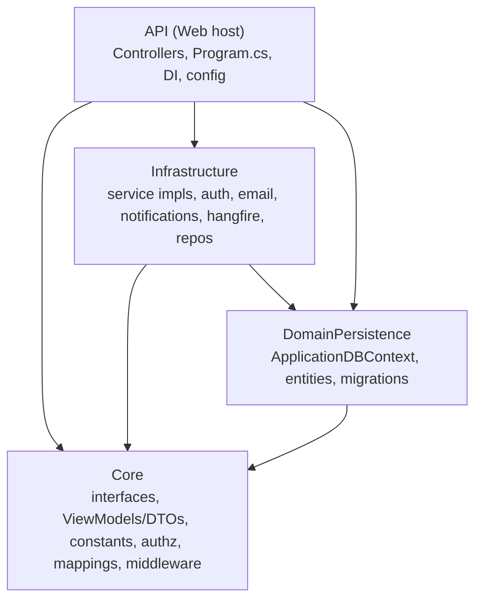

# Backend Architecture (.NET 9) — `gms-backend`

> Solution: `gms.sln`. Clean/onion architecture. Target framework **`net9.0`** (with `<RollForward>Major</RollForward>` in `API/API.csproj` so it can run on .NET 10). See [CLAUDE.md](../CLAUDE.md) for setup; [apis.md](apis.md) for the endpoint inventory; [database.md](database.md) for entities/migrations.

## Project dependency diagram

- **API** references Core, Infrastructure, DomainPersistence.
- **Infrastructure** references Core + DomainPersistence (implements Core interfaces, uses EF entities).
- **DomainPersistence** references Core (uses shared abstractions). *(Exact `.csproj` reference edges — Needs confirmation, but the above matches the code usage.)*
- **Core** is the innermost layer (few/no project deps).

---

## Project: API

**Responsibilities:** HTTP host, controllers, middleware pipeline, DI composition, configuration, API docs, SignalR hub mapping, Hangfire dashboard + recurring jobs.

### Entry point — `Program.cs`
Order of setup:
1. Serilog logger (console + rolling file `Logs/log-.txt`), `builder.Host.UseSerilog()`.
2. `AddControllers()`, `AddEndpointsApiExplorer()`.
3. **`AddApplicationServices(configuration)`** (see `Configurations/ServiceExtensions.cs`) — all DI.
4. `AddOpenApiDocumentation()` (native OpenAPI + Bearer scheme transformer).
5. API versioning (default v1), response compression (Brotli/Gzip), **CORS** policy `AllowAll` from `AllowedOrigins`.
6. **Startup migrate + seed:** scoped `ApplicationDBContext` → `Infrastructure.Data.DataSeeder.SeedAsync(...)` → `MigrateAsync()` + seeding.
7. Middleware order: `UseRouting` → `UseCors("AllowAll")` → `UseResponseCompression` → `UseRateLimiter` → **`MapHub<RealTimeHubService>("/realtimehub")`** → **Hangfire dashboard `/hangfire`** (+ `RecurringJob` `notification-cleanup` daily 03:00 UTC via `INotificationCleanupJob`) → OpenAPI `/openapi/{doc}.json` + **Scalar `/scalar`** + **Swagger `/swagger`** → `ExceptionHandlingMiddleware` → **`UseAuth()`** (custom: `UnauthorizedMiddleware` + `UseAuthentication` + `UseAuthorization`) → `UseSerilogRequestLogging` → `MapControllers`.

### Controllers (`API/Controllers/v1/`)
`BaseApiController` provides `ToResponse(...)` to emit `ApiResponse<T>`. Controllers:

| Controller | Base route |
|---|---|
| `AuthController` | `api/v1/auth` |
| `AccountRequestsController` | `api/v1/account-requests` |
| `UserInviteController` | `api/v1/user-invite` (public accept) |
| `UsersController` | `api/v1/users` |
| `UserAccessController` | `api/v1/user-access` |
| `RolesController` | `api/v1/roles` |
| `PermissionsController` | `api/v1/permissions` |
| `EventsController` | `api/v1/events` (+ sessions) |
| `GuestController` | `api/v1/guest` |
| `InvitationController` | `api/v1/invitation` (public) |
| `InvitationTemplateController` | `api/v1/invitation-templates` |
| `TravelController` | `api/v1/travel` |
| `LookupController` | `api/v1/lookups` |
| `NationalityController` | `api/v1/nationality` |
| `VenueController` | `api/v1/venue` |
| `SeatingController` | `api/v1/seating` |
| `MeetingController` | `api/v1/meeting` |
| `DashboardController` | `api/v1/dashboard` |
| `NotificationController` | `api/v1/notifications` (+ guest notifications/devices) |
| `SupportChatController` | `api/v1/support-chat` (guest `/my/*` + admin) |
| `VipAppController` | `api/v1/vip-app` (guest-facing OTP app) |
| `UploadController` | `api/v1/upload` |

Full per-endpoint detail in [apis.md](apis.md).

### Middleware
- `Core/Middlewares/ExceptionHandlingMiddleware.cs` — global exception → `ApiResponse` error; logs to Serilog / `SystemErrorLog`.
- `Core/Middlewares/UnauthorizedMiddleware.cs` — normalizes 401/403.
- `Infrastructure/Interceptors/AuditInterceptor.cs` — EF SaveChanges interceptor stamping `CreatedBy/At`, `UpdatedBy/At`, soft-delete fields.

### Authentication / authorization wiring
- `Infrastructure/Auth/Startup.cs` (`InitializeAuth`) configures JWT bearer from `Authentication:Jwt` (throws if `JwtSecretKey` missing).
- `Core/Authorization/`: `HasPermissionAttribute` (`AuthorizeAttribute` with `Policy = permission`), `PermissionRequirement`, `PermissionAuthorizationHandler` (checks `permission` claims). Policies auto-registered in `ServiceExtensions.ConfigureAuthorization` by reflecting over `PermissionCodes`.
- `Core/Common/LoggedInUser.cs`, `ICurrentUser` / `CurrentUser`, `ICurrentGuest` / `CurrentGuest` expose the authenticated principal (user vs guest-app).

### Dependency Injection (`Configurations/ServiceExtensions.cs`)
Registers (scoped unless noted): `AuditInterceptor`, `IUnitOfWork→UnitOfWork`, `ICurrentUser→CurrentUser`, `ICurrentGuest→CurrentGuest`, `BlobServiceClient` (singleton), auth services (`IAuthService`, `IEmailService`, `IPasswordResetTokenService`), domain services (`IUserService`, `IGuestService`, `INationalityService`, `ILookupService`, `IVenueService`, `ISeatingService`, `IMeetingService`, `ITravelService`, `IDashboardService`, `IInvitationService`, `IInvitationTemplateService`, `IEventService`, `IAccountRequestService`, `IUserAccessService`, `IRoleService`, `IPermissionService`, `IBlobService`, `IVipAppService`, `ISupportChatService`), notifications (`INotificationService`, `AddSignalR`, `IRealTimeAlertService`, `INotificationManagerService`, `IPushNotificationProvider→ManualNotificationProvider` **and** `→FirebaseNotificationProvider`, `INotificationCleanupJob→NotificationCleanupJob`), **Hangfire** (`AddHangfire` + server), AutoMapper (`MappingProfile`), FluentValidation (validators from `Core` assembly), `IAuthorizationHandler→PermissionAuthorizationHandler` (singleton), **rate limiters** (`"auth"` sliding window; a `"chat"` limiter is used by `SupportChatController`). Caching: `Infrastructure/Caching/Startup.cs` registers `ICacheService` (`DistributedCacheService` / `LocalCacheService`).

### Configuration
`Configurations/Startup.cs` layers `appsettings.json` + `appsettings.{env}.json` + `Configurations/{logger,auth,cache,database}.json` + env vars. Keys documented in [CLAUDE.md](../CLAUDE.md#configuration).

### API docs
Native .NET 9 OpenAPI (`AddOpenApi("v1")` + `BearerSecuritySchemeTransformer`) served at `/openapi/v1.json`, rendered by **Scalar** at `/scalar` and **Swagger UI** at `/swagger`.

---

## Project: Core

Innermost layer — abstractions, DTOs, constants, cross-cutting policy. **No entities live here** (entities are in DomainPersistence).

- **Interfaces** — `Core/Interfaces/Services/I*.cs` (one per domain service), `Core/Interfaces/Repositories/IGenericRepository.cs`, `IUnitOfWork.cs`, `Core/Common/Interfaces/*` (`ICurrentUser`, `ICacheService`, `ISerializerService`), `Core/Interfaces/IRealTimeAlertService.cs`.
- **ViewModels / DTOs** — `Core/ViewModel/<Module>/*` with `Create*Request`, `Update*Request`, `*Response`; plus `Core/ViewModel/Common/` (`ApiResponse`, `PagedRequest`, `PaginatedResponse`, `SendEmailResponse`), `BaseResponse`.
- **Constants** — `PermissionCodes` (all permission strings), `RoleDefinitions` (built-in roles + default permission sets), `ModuleDefinitions` (cross-module grant slugs → view permission), `Roles`, `BookingTypes`, `GuestConstants`, `GuestEnumCatalog`, `VenueCategories`, `NotificationTypes`, `Notification/SignalRTopics`.
- **Authorization** — `HasPermissionAttribute`, `PermissionRequirement`, `PermissionAuthorizationHandler`.
- **Mappings** — `Core/Mappings/MappingProfile.cs` (AutoMapper entity↔DTO; maps `PublicId → Id`, joins `Event.PublicId`, converts comma-strings ↔ lists).
- **Middlewares / Helpers** — `ExceptionHandlingMiddleware`, `UnauthorizedMiddleware`; `DateTimeHelper`, `RealTimeHubService` (SignalR hub), `TemplateHelper`.
- **Business rules / enums / validation** — enums live in `Core/Constants` (`GuestEnumCatalog`, guest invitation/accreditation statuses) and as `const` status strings; FluentValidation validators are discovered from the Core assembly.

---

## Project: Infrastructure

Implementations of Core interfaces + external integrations.

- **Services** (`Infrastructure/Services/`): `AccountRequestService`, `BlobService`, `CurrentUser`, `CurrentGuest`, `DashboardService`, `EventService`, `Guest.cs` (**`GuestService`** — CRUD, CSV import, accreditation, and **`SendInvitationAsync`** which builds/sends the invitation email), `InvitationService` (public token get/respond), `InvitationTemplateService`, `LookupService`, `MeetingService`, `NationalityService`, `PasswordResetTokenService`, `PermissionService`, `RoleService`, `SeatingService`, `SupportChatService`, `TravelService`, `UserAccessService`, `UserService`, `VenueService`, `VipAppService`.
- **Auth** (`Infrastructure/Auth/`): `AuthService` (login, JWT access + rotating refresh tokens by `jti`, OTP verify/resend, forgot/reset password, token validation, claim building incl. `permission` claims + module grants), `Startup.cs` (JWT bearer config).
- **Email** (`Infrastructure/Email/EmailService.cs`): branded HTML emails via Azure Communication Services / MailKit — password reset, OTP, **guest invitation** (`SendGuestInvitationAsync(email, GuestInvitationEmailModel)`; renders body HTML + optional CTA (`CtaUrl`) — CTA suppressed when empty), user invite.
- **Notifications** (`Infrastructure/Notification/`): `NotificationService`, `NotificationManagerService`, `RealTimeAlertService` (SignalR push), `ManualNotificationProvider` + `FirebaseNotificationProvider` (both `IPushNotificationProvider`), `NotificationCleanupJob` (Hangfire recurring purge).
- **Hangfire** (`Infrastructure/Hangfire/`): `HangfireAuthorizationFilter` (dashboard auth), setup.
- **Caching** (`Infrastructure/Caching/`): `DistributedCacheService`, `LocalCacheService`, `CacheSettings`.
- **Database** (`Infrastructure/Database/`): `Repositories/GenericRepository.cs`, `Repositories/UnitOfWork.cs`, `Startup.cs` (DbContext registration + `AuditInterceptor`).
- **Interceptors**: `AuditInterceptor`. **Logging**: `Logging/Serilog/Extensions.cs`, `LoggerSettings`. **Serializer**: `NewtonSoftService` (`ISerializerService`). **Blob**: `BlobService`. **Data**: `Data/DataSeeder.cs` + `Data/SeedData/` (seed nationalities/lookups/roles/permissions/admin).

---

## Project: DomainPersistence

- **DbContext**: `ApplicationDBContext` (partial): `ApplicationDBContext.cs` (users/auth/lookups/notifications/audit config) + `ApplicationDBContext.Gms.cs` (GMS domain DbSets + `OnModelCreatingPartial` config). Applies a **global soft-delete query filter** for `AuditEntity`-derived types and a **`PublicId` default `newid()`** convention.
- **Entities** — see [database.md](database.md) for the full list grouped by module. Base: `Entity` (`int Id` + `Guid PublicId`) : `AuditEntity` (audit + soft delete, `int?` user ids).
- **Migrations** (`DomainPersistence/Migrations/`) — chain (chronological): `first migration`, `added address column`, `added new tables and remove some`, `Add_VehicleType_DriverProfile_UserInvite_GuestDates`, `AddSupportChatConversations`, `AddNotificationAuditAndData`, `Add_Guest_PhotoUrl_AccreditationRequired`, `feat_added_fields_in_guest`, `added airportData table`, `fixed columns in airportData table`, `fixed column in airportData table`, `added driverId`, **`AddInvitationTemplateDesignConfig`** (latest — adds `InvitationTemplates.DesignConfig nvarchar(max) NULL`). ⚠️ The chain was **rewritten** relative to the pre-pull local DB — recreate local DBs from the current chain (see [current-status.md](current-status.md)).
- **Repository setup**: `GenericRepository<T>` + `UnitOfWork` (registered in API DI). Access pattern: `_unitOfWork.<Set>.Query()`, `GetByPublicIdAsync`, `AddAsync`, `Update`, `_unitOfWork.SaveChangesAsync`.
- **Seed data** (`DataSeeder`): applies migrations, syncs `Permission` rows from `PermissionCodes`, ensures built-in roles from `RoleDefinitions`, grants admin all permissions, seeds nationalities + lookup categories/items, creates the default admin user.
