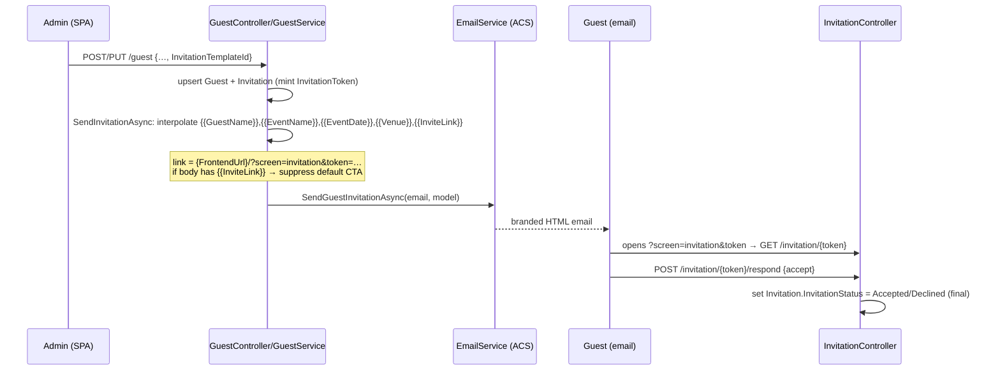
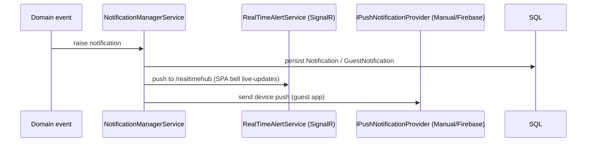

# Business Modules & Workflows

> Cross-references [apis.md](apis.md), [database.md](database.md), [frontend.md](frontend.md).

## Module map

| Module | Frontend page(s) | Backend controller(s) | Key entities | Status |
|---|---|---|---|---|
| Auth & onboarding | `AuthView`, `AccountRequestsView`, `UserInviteAcceptView` | `AuthController`, `AccountRequestsController`, `UserInviteController`, `UsersController` | User, Role, Permission, RolePermission, UserRefreshToken, OtpVerification, AccountRequest | Functional |
| Access control | `UsersView`, `UserAccessView`, roles/permissions UI | `UsersController`, `UserAccessController`, `RolesController`, `PermissionsController` | User, Role, RolePermission, UserModuleGrant | Functional |
| Events | `EventsView`, `DashboardView` | `EventsController`, `DashboardController` | Event, Session | Functional |
| Guests | `GuestsView`, `GuestDetailView`, guest modals | `GuestController` | Guest, GuestSession, Invitation | Functional |
| Invitations | `InvitationsView` (+ `EmailTemplateBuilder`), `InvitationResponseView` | `InvitationTemplateController`, `InvitationController` | InvitationTemplate, Invitation, Guest, Event | Functional |
| Accreditation | `AccreditationView`, `AccreditationModal` | `GuestController` (issue/revoke) | Invitation (AccreditationStatus), Guest | Functional (perm gap — see status) |
| Travel & logistics | `TravelView`, `VehiclesView`, `TravelAccordion` | `TravelController`, `LookupController` | Flight, FlightLeg, Accommodation, Transport, VehicleType, DriverProfile, AirportData, Location | Functional; Vehicles CRUD backend **⚠ NC** |
| Venue & seating | `VenueConfigView`, `SeatingView` | `VenueController`, `SeatingController` | Venue, VenueBox, VenueBlock, VenueLayout, VenueLayoutProp, SeatProperties, Seating, SeatAssign | Functional |
| Meetings | `MeetingsView` | `MeetingController` | Meeting (MeetingGuests) | Functional |
| Notifications | topbar bell, notifications panel | `NotificationController` | Notification, GuestNotification, GuestDevice | Functional |
| Support chat | `SupportChatView` | `SupportChatController` | SupportConversation, SupportMessage | Functional |
| Guest VIP app | (separate mobile client) | `VipAppController`, `NotificationController` (guest), `SupportChatController` (`/my/*`) | Guest, GuestRefreshToken, GuestDevice, GuestNotification | Functional (guest-facing API) |
| Organizations | `OrganizationsView` | — **⚠ NC** | — | Frontend only / pending backend |
| Reference/lookups | `LookupsView`, `NationalityController` | `LookupController`, `NationalityController` | LookupCategory/Item (via seed), Nationality, Hotel/Airport/etc. | Functional |

---

## Authentication

**Login → tokens**
```mermaid
sequenceDiagram
  participant U as User (SPA)
  participant A as AuthController
  participant S as AuthService
  participant DB as SQL
  U->>A: POST /auth/login {email,password}
  A->>S: LoginAsync
  S->>DB: user + role + permissions + module grants
  S->>S: BCrypt verify, check IsActive
  S->>S: GenerateTokenPair (access JWT + refresh JWT)
  S->>DB: store refresh jti (UserRefreshToken)
  S-->>A: ApiResponse<TokenResponse>
  A-->>U: {accessToken, refreshToken, user}
  U->>U: tokenStore.set; decode JWT; can(permission)
```
- **Access JWT claims:** identity (`uid/email/name/role/roleCode/roleId`) + **one `permission` claim per permission code** the user has (role permissions **+** `UserModuleGrant` view permissions). This is what both backend `[HasPermission]` and frontend `can()` read.
- **Refresh:** rotating — `/auth/refresh` validates the stored `jti`, revokes it, issues a new pair. Frontend `apiClient` does this transparently on a single 401.
- **Roles/permissions:** defined in `Core/Constants/RoleDefinitions.cs`; permission strings in `PermissionCodes.cs`; policies auto-registered.
- **Cross-module read:** `UserModuleGrant` (User Access page) adds only a module's `.View` permission — never write actions.
- **Protected routes (FE):** `RequireAuth` → `/login`; per-route `Guard` checks `can(permission)`. **Logout:** `/auth/logout` revokes the refresh token; frontend clears `tokenStore` and navigates to `/login`.
- **OTP:** email verification via `verify-otp` / `resend-otp` (also used by the VIP app's own OTP login).

## Self-service account request → approval
Requester submits details (→ `AccountRequest`, status `pending`). Admin reviews in `AccountRequestsView` → `POST /account-requests/{id}/approve` (creates a real `User` with chosen role) or `/reject`. Until approved the person cannot log in.

## Admin invites a user
Admin invites (users invite endpoints **⚠ NC**) → email with tokenized link → guest opens `?screen=userInvite&token=` (`UserInviteAcceptView`) → `POST /user-invite/{token}/accept` sets password/activates the account.

## Guest lifecycle & invitation send/respond

- Invitation is sent **implicitly** when a guest is created/updated with an `InvitationTemplateId` (also used to resend). `Invitation` is one row per guest (token, status, template, sentAt), separate from `Guest`.
- **Email template builder** (`EmailTemplateBuilder`, TipTap): admin designs background/fonts/size/images and places an **invite button** (serializes to `<a href="{{InviteLink}}">`). Saved as self-contained HTML in `InvitationTemplate.Body` + settings JSON in `DesignConfig`. Backend swaps `{{InviteLink}}` for the per-guest URL at send time.
- Public respond page is `[AllowAnonymous]`; a final Accept/Decline can't be flipped from the public page (admin can change it in the guest editor).

## Accreditation
`AccreditationView`/`AccreditationModal` → `POST /guest/{id}/accreditation/issue|revoke` → updates `Invitation.AccreditationStatus`. Badge shows a QR (qrcode.react). ⚠ Gated by `Guests.Update` (not `Accreditation.Issue/Revoke`) — see [current-status.md](current-status.md).

## Venue configuration & seating
```mermaid
sequenceDiagram
  participant Admin
  participant V as VenueController
  participant Seat as SeatingController
  Admin->>V: POST /venue (create), POST /venue/box (save layout per event/session)
  Admin->>V: POST /venue/{eventId} addBlock / element-types
  Note over V: Venue→VenueBox→VenueBlock/Layout→LayoutProp→SeatProperties
  Admin->>Seat: POST /seating {guest, seat, box, event, session}
  Seat->>Seat: SeatAssign (unique per Seating+Seat); declined guests excluded
  Admin->>Seat: GET /seating/box/{venueBoxId}
```
Floor plan built in `VenueConfigView` via `useVenueEditor` (drag/drop elements, blocks, seats). Fullscreen viewer via `?screen=venueView`.

## Travel & logistics
Per-guest bookings (a guest may hold several of each): `POST /travel/guest/{guestId}` with `GuestTravelRequest` adds/edits flight/accommodation/transport; `DELETE /travel/{type}/{id}` removes one. Per-event lists power `TravelView` tabs. Reference data (airlines, airports, hotels, room types, vehicle types, drivers, locations) via `LookupController` (writes need `Travel.Manage`).

## Meetings
`MeetingsView` → `POST /meeting` (create), `GET /meeting/{eventId}` (all meetings for an event — the route param named `id` is actually the eventId), `PUT /meeting` (edit). Guests linked via `MeetingGuests`.

## Dashboard
`GET /dashboard/{eventId}` → `GetDashboardResponse` (KPIs/aggregates for the active event). Gated by `Events.View`.

## Notifications

Admin bell reads `GET /notifications` + `/count`, mark read/unread/all, delete. Broadcast via `POST /notifications/send` (`Notifications.Send`). Guest-app notifications + device registration under `/notifications/guest/*`. **Hangfire** recurring job `notification-cleanup` purges old notifications daily at 03:00 UTC (`INotificationCleanupJob`).

## Support chat (guest ↔ organizers)
Guest app: `/support-chat/my/*` (list conversations/messages, send, mark read). Admin: `SupportChatView` → `/support-chat/conversations*` (list, messages, reply, read, close, reopen — `SupportChat.View`/`Manage`). Realtime via SignalR; composer is TipTap (`RichComposer`). Rate-limited (`chat`).

## Guest VIP App (separate client)
OTP login (`/vip-app/auth/*`) issuing guest JWT + `GuestRefreshToken`; then agenda, sessions, flights, accommodation, transportation, preferences, profile, settings, notifications, and support chat — a guest-facing companion, **not** part of the admin SPA.
