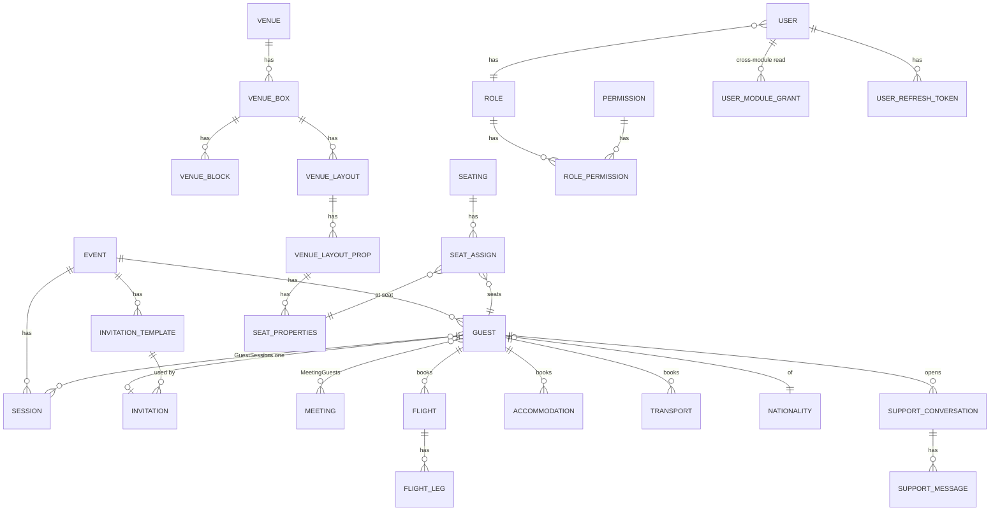

# Database

> EF Core 8 + **SQL Server**. Context: `ApplicationDBContext` (partial: `ApplicationDBContext.cs` + `ApplicationDBContext.Gms.cs`). See [backend.md](backend.md) for repository wiring.

## Conventions
- **Base types:** `Entity` (`int Id`, `Guid PublicId`) → `AuditEntity` (`int? CreatedBy/UpdatedBy/DeletedBy`, `DateTime CreatedAt/UpdatedAt?/DeletedAt?`, `bool? IsDeleted`).
- **`int Id`** is the internal PK used by all FKs/joins. **`Guid PublicId`** (DB default `newid()`) is the only id exposed via API routes/DTOs.
- **Soft delete:** global query filter excludes `IsDeleted = true` for `AuditEntity` types; `AuditInterceptor` stamps audit columns on `SaveChanges`.
- Most FK deletes use `Restrict` (SQL Server multiple-cascade-path avoidance); the app relies on soft delete.

## Entities (DbSets) grouped by module

| Module | Entities (DbSet) |
|---|---|
| **Identity/Auth** | `User`, `Role`, `Permission`, `RolePermission`, `UserRefreshToken`, `OtpVerification`, `UserModuleGrant`, `AccountRequest` |
| **Guest/VIP-app** | `Guest`, `GuestSession`, `GuestDevice`, `GuestNotification`, `GuestRefreshToken` |
| **Events** | `Event`, `EventType` (admin-managed lookup, replaces the old hardcoded type list), `Session` |
| **Invitations** | `InvitationTemplate`, `Invitation` |
| **Travel & logistics** | `Flight`, `FlightLeg`, `FlightType`, `FlightClass`, `Accommodation`, `AccommodationHotel`, `AccommodationRoomType`, `Transport`, `VehicleType`, `DriverProfile`, `AirportData`, `Location` |
| **Venue / Seating** | `Venue`, `VenueType`, `VenueBox`, `VenueBlock`, `VenueLayout`, `VenueLayoutProp`, `ElementType`, `Seating`, `SeatAssign`, `SeatProperties` |
| **Meetings** | `Meeting` (+ `MeetingGuests` join table) |
| **Reference** | `Nationality` |
| **Notifications** | `Notification`, `GuestNotification` |
| **Support Chat** | `SupportConversation`, `SupportMessage` |
| **Audit/logs** | `UserLoginLog`, `SystemErrorLog` |
| **Background jobs** | `ImportBatch`, `ImportBatchRow` — one row per bulk-import run (Events Excel, Guests CSV), processed by Hangfire; see [apis.md](apis.md) |

> Field-level detail lives in each `DomainPersistence/Entities/*.cs`. Notable: `Guest` (int `Id`+`PublicId`, `EventId`, `GuestType`, `Tier`, name/email/org, nationality, travel/accreditation-related fields — expanded by migrations `feat_added_fields_in_guest`, `Add_Guest_PhotoUrl_AccreditationRequired`, `GuestDates`). `Invitation` (one per guest: `GuestId`, `InvitationToken` Guid, `InvitationStatus`, `AccreditationStatus`, `InvitationTemplateId`, `SentAt`) is **separate** from `Guest`. `InvitationTemplate` (`Body` HTML, `DesignConfig` JSON, `Subject`, `Language`, `TargetTiers`, `Color`, `EventId`).

## Key relationships (high level)

*(FK cardinalities are representative; verify exact optionality in `ApplicationDBContext.Gms.cs`. Some edges — e.g. Support Chat participants — Needs confirmation.)*

## Important FK/design notes
- `Guest.EventId` → `Event` (Restrict). Guest ↔ Session via `GuestSession` (composite key). Guest ↔ Meeting via `MeetingGuests`.
- **Venue chain:** `Venue` (global, not per-event; `LocationId?` → `Location`, `ImageUrl?`) → `VenueBox` (per event/session, both nullable — null/null is a venue-wide shared/template box) → `VenueBlock`/`VenueLayout` → `VenueLayoutProp` → `SeatProperties`. `Seating`(event/venue/box/session) → `SeatAssign` (unique per `SeatingId`+`SeatId`) links `Guest` ↔ `SeatProperties`. Cloning a venue (`VenueController POST /{id}/clone`) deep-copies one `VenueBox` into a new `Venue`+`VenueBox` with `EventId`/`SessionId` both null and every `SeatProperties.Status` reset.
- **Auth:** `User`→`Role` (SetNull on delete), `Role`↔`Permission` via `RolePermission`, `UserModuleGrant` (unique per `UserId`+`Module`).

## Migrations (chronological)
`first migration` → `added address column` → `added new tables and remove some` → `Add_VehicleType_DriverProfile_UserInvite_GuestDates` → `AddSupportChatConversations` → `AddNotificationAuditAndData` → `Add_Guest_PhotoUrl_AccreditationRequired` → `feat_added_fields_in_guest` → `added airportData table` → `fixed columns in airportData table` → `fixed column in airportData table` → `added driverId` → `AddInvitationTemplateDesignConfig` (adds `InvitationTemplates.DesignConfig nvarchar(max) NULL`) → `AddSeatPlaceholderAndRemovedSeats` → `added image column in hotel table` → `MergeGuestIntoUserAndUnifyNotifications` → `added service column` → `AddVenueImageUrl` (adds `Venues.ImageUrl nvarchar(max) NULL`; `Venues.LocationId` already existed) → `AddEventTypeTable` → `AddImportBatchTables` → `BackfillEventVenueIdFromExistingBoxes` → **`AddFlightLegClassAndSeat`** (adds `FlightLegs.FlightClassId int NULL` FK→`FlightClasses`, `FlightLegs.Seat nvarchar(max) NULL` — a return booking's two legs can now carry different fare classes/seats).

⚠ This list is not reliably kept current — cross-check `DomainPersistence/Migrations/` for the true latest before relying on it.

⚠ The migration chain was **rewritten** vs. the pre-pull local DB (its initial migration timestamp differs). Local DBs created from the old chain must be **dropped & recreated** from the current chain (SQL error 2714 otherwise). Migrations auto-apply on API startup (`DataSeeder.MigrateAsync`) — the DB user needs DDL rights.

## Seed data (`Infrastructure/Data/DataSeeder.cs`)
On startup (idempotent): applies migrations → syncs `Permission` rows from `PermissionCodes` → ensures built-in roles from `RoleDefinitions` (`event-manager`, `invitations-manager`, `guest-relations-manager`, `travel-manager`, `accreditation-manager`, `seating-manager`, `venue-manager`, `protocol-manager`, `finance-manager`, `viewer`, `driver`; plus `admin`/`user`) → grants **admin** all permissions → seeds **nationalities** (world list, EN/AR/flag) and **lookup categories/items** (airlines, airports, vehicle types, hotels, venue types, element types) → creates the **default admin** (`Seed:AdminEmail` / `AdminPassword`, default `admin@gms.local` / `Admin@123!`). Seed source files under `Infrastructure/Data/SeedData/`.
